```mermaid
graph TD
    A[500+ files in Downloads/] --> B[Load file-organizer skill]
    B --> C[Scan directory via filesystem-mcp]
    C --> D[Categorize by file type: PDF, PNG, JPG]
    D --> E[Load invoice-organizer skill]
    E --> F[For each file: Extract text]
    F --> G[PDF → document-skills-pdf]
    F --> H[Image → ocr-mcp]
    G --> I[Parse: Date, Amount, Vendor, Category]
    H --> I
    I --> J[Rename: YYYY-MM-DD_Vendor_Amount_Category.ext]
    J --> K[Organize into folders by category]
    K --> L[Load document-skills-xlsx]
    L --> M[Create summary spreadsheet]
    M --> N[Export: 2024_Tax_Summary.xlsx]
```

# Agent Hive Use Cases
## 10 Real-World Scenarios for Claude Skills Catalog

**Version:** 2.0.0
**Last Updated:** 2025-11-09
**Purpose:** Demonstrate optimal agent hive patterns and skill orchestration

---

## 🎯 Overview

This document presents 10 comprehensive use cases demonstrating how the Agent Hive system uses the skills catalog for intelligent task routing, token optimization, and MCP integration. Each use case shows:

1. **User Request** - The original task
2. **Agent Routing** - Which agent pool handles it
3. **Skills Loaded** - Which skills are activated
4. **MCP Servers Used** - External integrations
5. **Token Budget** - Optimization vs. loading all skills
6. **Execution Flow** - Step-by-step process
7. **Success Metrics** - Measurable outcomes

---

## Use Case 1: Competitive Market Intelligence

### User Request
> "I'm launching a new AI productivity tool. Research my top 5 competitors, analyze their advertising strategies, and suggest positioning for my product."

### Agent Routing
**Selected Pool:** Business Intelligence Agents
**Reason:** Market research + competitive analysis

### Skills Loaded
1. `competitive-ads-extractor` (2.5K tokens)
2. `lead-research-assistant` (3.1K tokens)
3. `content-research-writer` (3.4K tokens)

**Total:** 9K tokens vs. 89K (all skills) = **90% reduction**

### MCP Servers Used
- `ads-library-mcp` - Facebook/Meta ad analysis
- `linkedin-scraper-mcp` - Company research
- `web-search-mcp` - Competitive intelligence

### Execution Flow


### Detailed Steps

1. **Catalog Lookup** (4K tokens)
   - Search "competitive analysis" → Route to business-marketing category
   - Identify: competitive-ads-extractor, lead-research-assistant

2. **Skill Activation** (9K tokens)
   - Load competitive-ads-extractor SKILL.md
   - Load lead-research-assistant SKILL.md
   - Load content-research-writer SKILL.md

3. **MCP Server Calls**
   - `ads-library-mcp.search_ads("Notion")` → 50 ads
   - `ads-library-mcp.search_ads("ClickUp")` → 50 ads
   - `ads-library-mcp.analyze_campaign("Notion", "messaging")` → Insights
   - `linkedin-scraper-mcp.get_company_profile("Notion")` → Company data
   - `linkedin-scraper-mcp.get_company_profile("ClickUp")` → Company data

4. **Synthesis**
   - Extract messaging themes from ads
   - Identify positioning gaps
   - Generate differentiation strategy

### Success Metrics
- ✅ Research completed in 3 minutes (vs. 20 minutes manual)
- ✅ 90% token reduction vs. loading all skills
- ✅ 5 competitor profiles generated
- ✅ 250+ ads analyzed
- ✅ Positioning recommendations delivered

---

## Use Case 2: Full-Stack Web Application Development

### User Request
> "Build me a task management web app with a modern UI, dark mode, and local storage. Make it production-ready with testing."

### Agent Routing
**Selected Pool:** Development Agents
**Reason:** Code generation + testing

### Skills Loaded
1. `artifacts-builder` (4.8K tokens)
2. `theme-factory` (2.4K tokens)
3. `webapp-testing` (2.9K tokens)
4. `brand-guidelines` (1.2K tokens) - Optional for professional styling

**Total:** 11.3K tokens vs. 89K = **87% reduction**

### MCP Servers Used
- `browser-automation-mcp` (Playwright) - Testing
- `npm-registry-mcp` - Dependency management

### Execution Flow


### Detailed Steps

1. **Skill Selection** (Catalog lookup)
   - "web app" → artifacts-builder
   - "modern UI" + "dark mode" → theme-factory
   - "testing" → webapp-testing

2. **Artifact Initialization**
   ```bash
   # Via artifacts-builder skill
   ./scripts/init-artifact.sh task-manager
   cd task-manager
   npm install
   ```

3. **Component Development**
   - Create TaskList component (React)
   - Create TaskForm component
   - Implement dark mode context
   - Apply theme from theme-factory (e.g., "Modern Professional")

4. **Business Logic**
   - localStorage integration for persistence
   - Task CRUD operations
   - Filter/sort functionality

5. **Testing** (Via webapp-testing + Playwright MCP)
   ```python
   # Via webapp-testing skill
   - Test task creation
   - Test dark mode toggle
   - Test localStorage persistence
   - Capture screenshots
   ```

6. **Bundling**
   ```bash
   # Via artifacts-builder
   ./scripts/bundle-artifact.sh
   # Output: single HTML file with embedded React
   ```

### Success Metrics
- ✅ Full web app in 15 minutes (vs. 2+ hours manual)
- ✅ Production-ready code with TypeScript
- ✅ Responsive design with Tailwind
- ✅ 100% test coverage for core features
- ✅ Single-file deployment artifact

---

## Use Case 3: Tax Season Invoice Organization

### User Request
> "I have 500+ receipts and invoices from 2024 in various formats (PDFs, images, emails). Organize them by category, extract amounts, and create a summary spreadsheet for my accountant."

### Agent Routing
**Selected Pool:** Document Processing Agents
**Reason:** File organization + OCR + document creation

### Skills Loaded
1. `invoice-organizer` (2.6K tokens)
2. `file-organizer` (2.3K tokens)
3. `document-skills-xlsx` (6.9K tokens)
4. `document-skills-pdf` (6.8K tokens) - For PDF reading

**Total:** 18.6K tokens vs. 89K = **79% reduction**

### MCP Servers Used
- `filesystem-mcp` - Safe file operations
- `ocr-mcp` - Text extraction from images
- PDF parsing libraries (local)

### Execution Flow



### Detailed Steps

1. **Initial Scan** (file-organizer + filesystem-mcp)
   ```
   Downloads/
   ├── IMG_1234.jpg (receipt)
   ├── invoice.pdf
   ├── receipt_march.png
   └── ... (497 more files)
   ```

2. **Categorization**
   - Identify invoice patterns (keywords: "invoice", "receipt", "payment")
   - Group by file type for processing

3. **Text Extraction** (invoice-organizer)
   - PDFs: Use document-skills-pdf to extract text
   - Images: Use ocr-mcp for OCR
   - Extract structured data:
     ```json
     {
       "date": "2024-03-15",
       "vendor": "Office Depot",
       "amount": 234.56,
       "category": "Office Supplies",
       "taxDeductible": true
     }
     ```

4. **File Renaming & Organization**
   ```
   Invoices_2024/
   ├── Office_Supplies/
   │   └── 2024-03-15_OfficeDep ot_234.56_OfficeSupplies.pdf
   ├── Travel/
   │   └── 2024-06-20_United_567.89_Travel.pdf
   ├── Software/
   │   └── 2024-01-10_Adobe_52.99_Software.pdf
   └── Utilities/
       └── 2024-02-01_Comcast_89.99_Utilities.pdf
   ```

5. **Spreadsheet Creation** (document-skills-xlsx)
   ```
   | Date       | Vendor      | Category        | Amount  | Tax Deductible |
   |------------|-------------|-----------------|---------|----------------|
   | 2024-01-10 | Adobe       | Software        | $52.99  | Yes            |
   | 2024-02-01 | Comcast     | Utilities       | $89.99  | No             |
   | ...        | ...         | ...             | ...     | ...            |
   | TOTAL      |             |                 | $45,678 |                |
   ```

6. **Summary Report**
   - Total expenses by category
   - Tax-deductible vs. non-deductible
   - Monthly breakdown

### Success Metrics
- ✅ 500 files processed in 10 minutes (vs. 8+ hours manual)
- ✅ 95%+ OCR accuracy
- ✅ Organized into 12 categories
- ✅ Ready-to-submit spreadsheet for accountant
- ✅ $45,678 in expenses cataloged

---

## Use Case 4: Content Marketing Campaign Creation

### User Request
> "Write a comprehensive blog post about 'The Future of AI in Healthcare' with proper research, citations, and create social media GIFs for promotion on Slack and Twitter."

### Agent Routing
**Selected Pool:** Content & Communication Agents + Creative Agents (Multi-pool)
**Reason:** Research writing + visual content creation

### Skills Loaded
1. `content-research-writer` (3.4K tokens)
2. `slack-gif-creator` (5.8K tokens)
3. `theme-factory` (2.4K tokens) - For consistent branding

**Total:** 11.6K tokens vs. 89K = **87% reduction**

### MCP Servers Used
- `web-search-mcp` - Research
- `citation-mcp` - Academic citations
- `image-processing-mcp` - GIF optimization

### Execution Flow


### Detailed Steps

1. **Research Phase** (content-research-writer + web-search-mcp)
   - Query: "AI healthcare 2024 trends research papers"
   - Find sources:
     - 5 peer-reviewed papers
     - 10 industry articles
     - 5 case studies
   - Extract citations via citation-mcp

2. **Writing Phase**
   - Generate outline (5 sections)
   - Write introduction with hook
   - Section 1: Current AI applications in healthcare
   - Section 2: Emerging technologies
   - Section 3: Challenges and ethics
   - Section 4: Future predictions
   - Section 5: Conclusion
   - Add citations in APA format

3. **Visual Content Creation** (slack-gif-creator)
   - **GIF 1:** "AI + Healthcare" animation
     - Template: `pulse` animation
     - Colors: Medical theme (blue/white)
     - Text: "The Future is Here"
     - Size: <1MB for Slack

   - **GIF 2:** "Statistics" animation
     - Template: `fade` + `slide`
     - Show key stats from article
     - Size optimized for Twitter

   - **GIF 3:** "Call to Action"
     - Template: `bounce`
     - Text: "Read More →"
     - Brand colors from theme-factory

4. **Quality Check**
   - Verify all citations
   - Fact-check statistics
   - Validate GIF sizes for platforms

### Success Metrics
- ✅ 2,000-word article in 20 minutes (vs. 4+ hours manual)
- ✅ 15 academic citations
- ✅ 3 platform-optimized GIFs
- ✅ Ready to publish
- ✅ SEO-optimized content

---

## Use Case 5: MCP Server Development for Custom API

### User Request
> "I want to create an MCP server for our company's internal CRM API so our agents can access customer data, create tickets, and update records."

### Agent Routing
**Selected Pool:** Development Agents
**Reason:** MCP server creation

### Skills Loaded
1. `mcp-builder` (8.5K tokens) ⭐ CORE SKILL
2. `skill-creator` (6.2K tokens) - For packaging
3. References from mcp-builder (28K tokens - loaded progressively)

**Total:** 14.7K base + 28K references = 42.7K tokens
**Note:** This is a complex task requiring reference materials, but still saves 46K tokens vs. loading all skills

### MCP Servers Used
- None (we're building one!)

### Execution Flow


### Detailed Steps

1. **Planning** (mcp-builder Phase 1)
   - Review CRM API docs
   - Plan tools:
     - `get_customer(customer_id)` - Fetch customer details
     - `search_customers(query, filters)` - Search customers
     - `create_ticket(customer_id, issue)` - Create support ticket
     - `update_customer(customer_id, data)` - Update customer record
     - `get_tickets(customer_id)` - List customer tickets
   - Design response formats (JSON + Markdown)
   - Plan pagination (max 100 results per call)

2. **Implementation** (mcp-builder Phase 2)
   ```python
   # crm_server.py
   from mcp import FastMCP
   from pydantic import BaseModel, Field

   mcp = FastMCP("company-crm")

   class CustomerSearch(BaseModel):
       query: str = Field(description="Search query")
       max_results: int = Field(default=20, le=100)
       format: Literal["json", "markdown"] = "markdown"

   @mcp.tool(description="Search for customers in CRM")
   async def search_customers(params: CustomerSearch) -> str:
       """
       Search for customers by name, email, or company.

       Returns customer list with ID, name, email, company.
       Use JSON format for programmatic access.
       """
       # Implementation with API client
       ...

   # 4 more tools...
   ```

3. **Testing** (mcp-builder Phase 4)
   - Create evaluation questions:
     1. "Find all customers from Acme Corp and list their open tickets"
     2. "Create a high-priority ticket for customer ID 12345 about billing issues"
     3. "Update customer 67890's email address to newemail@example.com"
     ...
   - Run evaluation harness
   - Verify all questions answered correctly

4. **Packaging** (skill-creator)
   ```bash
   scripts/package_skill.py ./crm-mcp-server
   # Output: crm-mcp-server.zip
   ```

5. **Deployment**
   - Add to claude_desktop_config.json:
     ```json
     {
       "mcpServers": {
         "company-crm": {
           "command": "python",
           "args": ["-m", "crm_server"],
           "env": {
             "CRM_API_KEY": "${CRM_API_KEY}",
             "CRM_BASE_URL": "https://crm.company.com/api"
           }
         }
       }
     }
     ```

### Success Metrics
- ✅ MCP server with 5 tools created in 2 hours (vs. 8+ hours without guide)
- ✅ Full Pydantic validation
- ✅ Comprehensive error handling
- ✅ 10 evaluation questions (100% pass rate)
- ✅ Production-ready deployment configuration

---

## Use Case 6: Brand-Consistent Pitch Deck Creation

### User Request
> "Create a professional pitch deck for our Series A fundraise with consistent branding, professional themes, and export to PowerPoint."

### Agent Routing
**Selected Pool:** Document Processing + Creative (Multi-pool)
**Reason:** Presentation creation + design

### Skills Loaded
1. `document-skills-pptx` (6.5K tokens)
2. `theme-factory` (2.4K tokens)
3. `brand-guidelines` (1.2K tokens)
4. `canvas-design` (2.7K tokens) - For custom graphics

**Total:** 12.8K tokens vs. 89K = **86% reduction**

### MCP Servers Used
- `font-library-mcp` - Professional fonts
- `image-processing-mcp` - Image optimization

### Execution Flow

1. **Theme Selection** (theme-factory)
   - Choose: "Executive Professional" theme
   - Colors: Navy (#1a237e), White, Accent Gold (#ffc107)
   - Fonts: Montserrat (headers), Open Sans (body)

2. **Slide Creation** (document-skills-pptx)
   - Slide 1: Title (company logo, tagline)
   - Slide 2: Problem statement
   - Slide 3: Solution
   - Slide 4: Market size
   - Slide 5: Product demo screenshots
   - Slide 6: Traction metrics
   - Slide 7: Team
   - Slide 8: Financials
   - Slide 9: Ask (funding amount, use of funds)
   - Slide 10: Thank you + contact

3. **Brand Application** (brand-guidelines)
   - Apply Anthropic brand standards (if applicable)
   - Consistent logo placement
   - Typography hierarchy

4. **Custom Graphics** (canvas-design)
   - Create custom icons for problem/solution
   - Design market size visualization
   - Product mockups

5. **Export**
   - Output: pitch_deck.pptx (PowerPoint format)
   - Also export: pitch_deck.pdf (for email)

### Success Metrics
- ✅ 10-slide deck in 30 minutes
- ✅ Professional design with consistent branding
- ✅ Ready for investor presentations
- ✅ Editable PPTX format

---

## Use Case 7: Open-Source Project Release Management

### User Request
> "Generate a changelog from our last 150 git commits, create release notes in markdown and PDF, and update our documentation."

### Agent Routing
**Selected Pool:** Development Agents
**Reason:** Git operations + documentation

### Skills Loaded
1. `changelog-generator` (2.1K tokens)
2. `document-skills-pdf` (6.8K tokens)
3. `content-research-writer` (3.4K tokens) - For release notes polish

**Total:** 12.3K tokens vs. 89K = **86% reduction**

### MCP Servers Used
- `git-mcp` - Repository access
- `github-mcp` - Release creation

### Execution Flow


### Detailed Steps

1. **Commit Analysis** (changelog-generator + git-mcp)
   ```bash
   git log --oneline -150
   ```
   - Categorize by type:
     - feat: New features (45 commits)
     - fix: Bug fixes (78 commits)
     - chore: Maintenance (20 commits)
     - docs: Documentation (7 commits)

2. **User-Friendly Transformation**
   - Technical: `feat: add JWT auth to API`
   - User-Facing: `Added secure authentication for API access`

   - Technical: `fix: resolve memory leak in worker pool`
   - User-Facing: `Fixed performance issue causing high memory usage`

3. **Changelog Generation**
   ```markdown
   # Changelog - v2.0.0

   ## 🎉 New Features
   - Added secure authentication for API access
   - Introduced real-time collaboration
   - Added dark mode support

   ## 🐛 Bug Fixes
   - Fixed performance issue causing high memory usage
   - Resolved login timeout errors
   - Fixed data export corruption

   ## 📚 Documentation
   - Updated API documentation
   - Added deployment guide
   ```

4. **Release Notes Polish** (content-research-writer)
   - Add executive summary
   - Highlight top 5 features
   - Migration guide for breaking changes

5. **PDF Generation** (document-skills-pdf)
   - Professional formatting
   - Company branding
   - Export: RELEASE_NOTES_v2.0.0.pdf

6. **Publish** (github-mcp)
   - Create GitHub release
   - Attach PDF
   - Tag version

### Success Metrics
- ✅ Changelog from 150 commits in 5 minutes
- ✅ User-friendly descriptions
- ✅ PDF + Markdown formats
- ✅ Published to GitHub

---

## Use Case 8: Lead Generation & Outreach Campaign

### User Request
> "Find 50 qualified leads in the fintech industry (Series A-B, 50-200 employees, using Stripe), and draft personalized outreach emails."

### Agent Routing
**Selected Pool:** Business Intelligence Agents
**Reason:** Lead research + qualification

### Skills Loaded
1. `lead-research-assistant` (3.1K tokens)
2. `content-research-writer` (3.4K tokens) - For email drafting

**Total:** 6.5K tokens vs. 89K = **93% reduction**

### MCP Servers Used
- `linkedin-scraper-mcp` - Company search
- `clearbit-mcp` - Company enrichment (hypothetical)

### Execution Flow


### Detailed Steps

1. **ICP Definition**
   ```json
   {
     "industry": "Fintech",
     "fundingStage": ["Series A", "Series B"],
     "employeeCount": [50, 200],
     "technologies": ["Stripe", "Plaid"],
     "location": "United States"
   }
   ```

2. **Company Search** (linkedin-scraper-mcp)
   - Query: 150 companies matching ICP
   - Enrich with:
     - Company size
     - Funding info
     - Tech stack
     - Decision-maker contacts

3. **Lead Scoring**
   - Firmographic fit: 40 points
   - Technographic fit: 30 points
   - Engagement signals: 20 points
   - Contact quality: 10 points

4. **Qualification** (Top 50)
   ```csv
   Company,Score,Funding,Employees,Technologies,Contact,Email
   Acme Fintech,94,Series A ($5M),75,Stripe+Plaid,John Doe,john@acme.com
   BetaPay,91,Series B ($12M),120,Stripe,Jane Smith,jane@betapay.com
   ...
   ```

5. **Email Personalization** (content-research-writer)
   ```
   Subject: {{Company}} + {{OurProduct}} integration idea

   Hi {{FirstName}},

   I noticed {{Company}} recently {{RecentNews}} and uses {{TechStack}}.

   We help fintech companies like yours {{ValueProp}}.

   Would you be open to a 15-minute call to discuss how we can help {{SpecificPainPoint}}?

   Best,
   {{Sender}}
   ```

6. **Output**
   - leads.csv (50 qualified leads)
   - email_templates/ (50 personalized drafts)

### Success Metrics
- ✅ 50 qualified leads in 15 minutes (vs. days of manual research)
- ✅ 94+ average lead score
- ✅ Personalized outreach for each
- ✅ Ready to launch campaign

---

## Use Case 9: Meeting Analysis & Action Items

### User Request
> "Analyze the transcript from our leadership meeting, identify speaking patterns, extract action items, and create a summary report with follow-up tasks."

### Agent Routing
**Selected Pool:** Content & Communication Agents
**Reason:** Transcript analysis

### Skills Loaded
1. `meeting-insights-analyzer` (2.8K tokens)
2. `content-research-writer` (3.4K tokens) - For report writing
3. `document-skills-docx` (7.2K tokens) - For formatted report

**Total:** 13.4K tokens vs. 89K = **85% reduction**

### MCP Servers Used
- `transcript-analysis-mcp` - NLP analysis
- None (can run locally)

### Execution Flow


### Detailed Steps

1. **Transcript Upload**
   - 45-minute meeting
   - 8 participants
   - 12,000 words

2. **Speaking Analysis** (meeting-insights-analyzer)
   ```
   Speaking Ratios:
   - CEO (Alice): 35% (dominant speaker)
   - CTO (Bob): 22%
   - CFO (Carol): 18%
   - Others: 25% combined

   Behavioral Patterns:
   - Interruptions: Alice interrupted others 12 times
   - Questions asked: Bob asked 23 questions (most engaged)
   - Filler words: Carol used "um/uh" 45 times (nervous?)
   ```

3. **Sentiment & Conflict**
   ```
   Overall Sentiment: Neutral (0.52/1.0)

   Conflict Moments:
   - 00:18:30 - Disagreement on Q4 budget (Alice vs. Carol)
   - 00:32:15 - Feature prioritization debate

   Agreement Moments:
   - Strong consensus on new hire for engineering
   ```

4. **Action Items Extraction**
   ```markdown
   ## Decisions Made
   1. Approve $500K Q4 marketing budget
   2. Hire 2 senior engineers by end of quarter
   3. Launch new feature in beta by November 15

   ## Action Items
   - [ ] @Alice: Present budget breakdown by Friday
   - [ ] @Bob: Create engineering job descriptions
   - [ ] @Carol: Review cash flow projections
   - [ ] @David: Schedule beta testers recruitment
   ```

5. **Report Generation** (document-skills-docx)
   - Executive summary (1 page)
   - Detailed analysis (3 pages)
   - Visualizations (speaking ratios, sentiment chart)
   - Action items with assignments
   - Export: meeting_analysis.docx

### Success Metrics
- ✅ 45-minute transcript analyzed in 3 minutes
- ✅ 12 action items identified with owners
- ✅ Leadership insights delivered (speaking patterns, conflict detection)
- ✅ Professional DOCX report generated

---

## Use Case 10: Multi-Format Documentation Suite

### User Request
> "Create a complete product documentation suite: User guide (DOCX), Quick start (PDF), API reference (Markdown), and Marketing one-pager (PDF with visuals)."

### Agent Routing
**Selected Pool:** Document Processing + Creative (Multi-pool)
**Reason:** Multiple document formats + design

### Skills Loaded
1. `document-skills-docx` (7.2K tokens)
2. `document-skills-pdf` (6.8K tokens)
3. `content-research-writer` (3.4K tokens)
4. `theme-factory` (2.4K tokens)
5. `canvas-design` (2.7K tokens)

**Total:** 22.5K tokens vs. 89K = **75% reduction**

### MCP Servers Used
- `image-processing-mcp` - Diagram generation
- None (mostly local processing)

### Execution Flow


### Detailed Steps

1. **User Guide** (document-skills-docx)
   - 50-page comprehensive guide
   - Chapters:
     1. Introduction
     2. Getting Started
     3. Features
     4. Advanced Usage
     5. Troubleshooting
     6. FAQ
   - Apply "Corporate Professional" theme from theme-factory
   - Export: user_guide.docx

2. **Quick Start PDF** (document-skills-pdf)
   - 5-page visual guide
   - Step-by-step with screenshots
   - Annotations and callouts
   - Export: quick_start.pdf

3. **API Reference** (content-research-writer)
   ```markdown
   # API Reference

   ## Authentication
   All requests require Bearer token...

   ## Endpoints

   ### GET /api/users
   Retrieve list of users

   **Parameters:**
   - `limit` (int): Max results
   - `offset` (int): Pagination offset

   **Response:**
   ```json
   {
     "users": [...],
     "total": 1000
   }
   ```

   ...
   ```
   - Export: API_REFERENCE.md

4. **Marketing One-Pager** (canvas-design + document-skills-pdf)
   - Visual design with product screenshots
   - Key features highlighted
   - Call to action
   - Company branding
   - Export: product_one_pager.pdf

5. **Package**
   ```
   documentation_suite/
   ├── user_guide.docx
   ├── quick_start.pdf
   ├── API_REFERENCE.md
   └── product_one_pager.pdf
   ```

### Success Metrics
- ✅ 4 documents created in 45 minutes (vs. days manual)
- ✅ Consistent branding across all docs
- ✅ Professional formatting
- ✅ Ready for distribution

---

## 📊 Aggregate Performance Analysis

### Token Optimization Across All Use Cases

| Use Case | Skills Loaded | Tokens Used | vs. All Skills | Reduction |
|----------|---------------|-------------|----------------|-----------|
| 1. Market Intelligence | 3 | 9K | 89K | 90% |
| 2. Web App Development | 4 | 11.3K | 89K | 87% |
| 3. Invoice Organization | 4 | 18.6K | 89K | 79% |
| 4. Content Marketing | 3 | 11.6K | 89K | 87% |
| 5. MCP Server Dev | 2+refs | 42.7K | 89K | 52% |
| 6. Pitch Deck | 4 | 12.8K | 89K | 86% |
| 7. Release Management | 3 | 12.3K | 89K | 86% |
| 8. Lead Generation | 2 | 6.5K | 89K | 93% |
| 9. Meeting Analysis | 3 | 13.4K | 89K | 85% |
| 10. Documentation Suite | 5 | 22.5K | 89K | 75% |
| **AVERAGE** | **3.3** | **16.1K** | **89K** | **82%** |

### Time Savings

| Use Case | Agent Hive Time | Manual Time | Savings |
|----------|----------------|-------------|---------|
| 1. Market Intelligence | 3 min | 20 min | 85% |
| 2. Web App Development | 15 min | 2 hours | 87.5% |
| 3. Invoice Organization | 10 min | 8 hours | 97.9% |
| 4. Content Marketing | 20 min | 4 hours | 91.7% |
| 5. MCP Server Dev | 2 hours | 8 hours | 75% |
| 6. Pitch Deck | 30 min | 3 hours | 83.3% |
| 7. Release Management | 5 min | 30 min | 83.3% |
| 8. Lead Generation | 15 min | 2 days | 99.5% |
| 9. Meeting Analysis | 3 min | 20 min | 85% |
| 10. Documentation Suite | 45 min | 3 days | 99.0% |
| **AVERAGE** | **23 min** | **5.5 hours** | **88.7%** |

---

## 🎓 Key Learnings

### Best Practices from Use Cases

1. **Progressive Disclosure Works**
   - Load catalog (4K) → Category (600) → Skill metadata (100) → Full skill (avg 3K)
   - Average 82% token reduction

2. **Multi-Pool Orchestration**
   - Use Cases 4, 6, 10 benefited from multiple agent pools
   - Seamless handoff between pools

3. **MCP Integration Amplifies Value**
   - External API access (ads-library, linkedin-scraper) enable new capabilities
   - Local MCP servers (filesystem, ocr) provide safety and consistency

4. **Skill Composition**
   - Average 3.3 skills per use case
   - Dependencies matter (theme-factory + document-skills)

5. **Time ROI**
   - 88.7% average time savings
   - Biggest wins: Automated tasks (invoices, leads, documentation)

---

**End of Use Cases**
