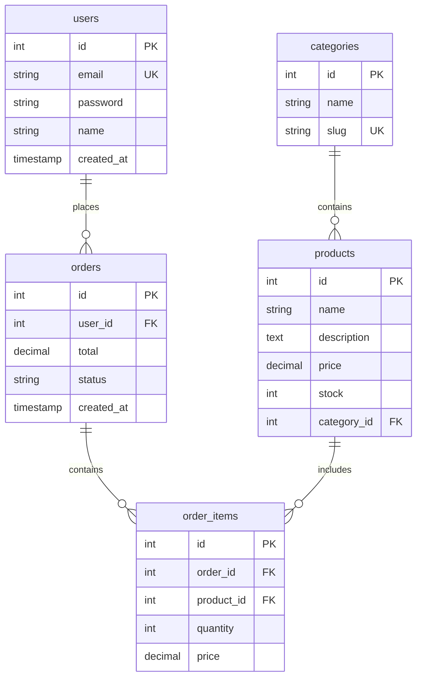

# Database Schema Designer

Automatically generate production-ready database schemas from natural language descriptions. This skill creates SQL DDL statements, entity-relationship diagrams (using Mermaid), and ORM migration files for PostgreSQL, MySQL, and SQLite with support for Prisma, TypeORM, and Alembic.

## What It Does

The Database Schema Designer skill:

1. **Parses Requirements** - Understands entity descriptions and relationships
2. **Generates SQL Schema** - Creates complete DDL with tables, columns, constraints
3. **Creates ER Diagrams** - Produces Mermaid diagrams showing relationships
4. **Indexes & Constraints** - Adds primary keys, foreign keys, unique constraints, indexes
5. **Migration Files** - Generates Prisma, TypeORM, or Alembic migrations
6. **Normalization** - Suggests normalized table structures
7. **Seed Data** - Optional sample data for development

## Key Features

- **Multi-Database Support**: PostgreSQL, MySQL, SQLite with dialect-specific syntax
- **Relationship Mapping**: One-to-one, one-to-many, many-to-many with junction tables
- **Data Types**: Intelligent type mapping based on field descriptions
- **Constraints**: Primary keys, foreign keys, unique, check, not null
- **Indexing**: Automatic index recommendations for performance
- **ER Diagrams**: Visual Mermaid diagrams for documentation
- **ORM Integration**: Prisma Schema, TypeORM entities, Alembic migrations
- **Best Practices**: Follows naming conventions and normalization principles

## When to Use This Skill

Use the Database Schema Designer when you need to:

- Design a new database schema from requirements
- Create SQL DDL for existing data models
- Generate ER diagrams for documentation
- Migrate between databases (PostgreSQL to MySQL)
- Generate ORM schema files
- Design normalized database structures
- Create migration files for version control

## Supported Databases

### SQL Databases
- **PostgreSQL**: Full support with advanced types (JSONB, arrays, enums)
- **MySQL**: InnoDB engine with proper charset and collation
- **SQLite**: Lightweight database for development and testing

### ORM Frameworks
- **Prisma**: Schema.prisma files with relations and migrations
- **TypeORM**: Entity classes with decorators
- **Alembic**: Python migration scripts for SQLAlchemy
- **Sequelize**: Model definitions for Node.js

## Example Usage

### Input: E-commerce Database Description

```
Create a database schema for an e-commerce platform with:

Entities:
- Users: id, email, password, name, created_at
- Products: id, name, description, price, stock, category_id
- Categories: id, name, slug
- Orders: id, user_id, total, status, created_at
- OrderItems: id, order_id, product_id, quantity, price

Relationships:
- Users have many Orders
- Products belong to Categories
- Orders have many OrderItems (many-to-many with Products)
```

### Output: Generated Database Schema

#### SQL Schema (PostgreSQL)

```sql
-- Users table
CREATE TABLE users (
    id SERIAL PRIMARY KEY,
    email VARCHAR(255) UNIQUE NOT NULL,
    password VARCHAR(255) NOT NULL,
    name VARCHAR(255) NOT NULL,
    created_at TIMESTAMP DEFAULT CURRENT_TIMESTAMP,
    updated_at TIMESTAMP DEFAULT CURRENT_TIMESTAMP
);

CREATE INDEX idx_users_email ON users(email);

-- Categories table
CREATE TABLE categories (
    id SERIAL PRIMARY KEY,
    name VARCHAR(100) NOT NULL,
    slug VARCHAR(100) UNIQUE NOT NULL,
    created_at TIMESTAMP DEFAULT CURRENT_TIMESTAMP
);

CREATE INDEX idx_categories_slug ON categories(slug);

-- Products table
CREATE TABLE products (
    id SERIAL PRIMARY KEY,
    name VARCHAR(255) NOT NULL,
    description TEXT,
    price DECIMAL(10, 2) NOT NULL CHECK (price >= 0),
    stock INTEGER NOT NULL DEFAULT 0 CHECK (stock >= 0),
    category_id INTEGER NOT NULL,
    created_at TIMESTAMP DEFAULT CURRENT_TIMESTAMP,
    updated_at TIMESTAMP DEFAULT CURRENT_TIMESTAMP,
    FOREIGN KEY (category_id) REFERENCES categories(id) ON DELETE CASCADE
);

CREATE INDEX idx_products_category ON products(category_id);
CREATE INDEX idx_products_price ON products(price);

-- Orders table
CREATE TABLE orders (
    id SERIAL PRIMARY KEY,
    user_id INTEGER NOT NULL,
    total DECIMAL(10, 2) NOT NULL CHECK (total >= 0),
    status VARCHAR(50) NOT NULL DEFAULT 'pending',
    created_at TIMESTAMP DEFAULT CURRENT_TIMESTAMP,
    updated_at TIMESTAMP DEFAULT CURRENT_TIMESTAMP,
    FOREIGN KEY (user_id) REFERENCES users(id) ON DELETE CASCADE
);

CREATE INDEX idx_orders_user ON orders(user_id);
CREATE INDEX idx_orders_status ON orders(status);
CREATE INDEX idx_orders_created ON orders(created_at);

-- OrderItems table (junction table for many-to-many)
CREATE TABLE order_items (
    id SERIAL PRIMARY KEY,
    order_id INTEGER NOT NULL,
    product_id INTEGER NOT NULL,
    quantity INTEGER NOT NULL CHECK (quantity > 0),
    price DECIMAL(10, 2) NOT NULL CHECK (price >= 0),
    created_at TIMESTAMP DEFAULT CURRENT_TIMESTAMP,
    FOREIGN KEY (order_id) REFERENCES orders(id) ON DELETE CASCADE,
    FOREIGN KEY (product_id) REFERENCES products(id) ON DELETE CASCADE,
    UNIQUE (order_id, product_id)
);

CREATE INDEX idx_order_items_order ON order_items(order_id);
CREATE INDEX idx_order_items_product ON order_items(product_id);
```

#### ER Diagram (Mermaid)



#### Prisma Schema

```prisma
generator client {
  provider = "prisma-client-js"
}

datasource db {
  provider = "postgresql"
  url      = env("DATABASE_URL")
}

model User {
  id        Int      @id @default(autoincrement())
  email     String   @unique
  password  String
  name      String
  createdAt DateTime @default(now()) @map("created_at")
  updatedAt DateTime @updatedAt @map("updated_at")
  orders    Order[]

  @@index([email])
  @@map("users")
}

model Category {
  id        Int      @id @default(autoincrement())
  name      String
  slug      String   @unique
  createdAt DateTime @default(now()) @map("created_at")
  products  Product[]

  @@index([slug])
  @@map("categories")
}

model Product {
  id          Int         @id @default(autoincrement())
  name        String
  description String?
  price       Decimal     @db.Decimal(10, 2)
  stock       Int         @default(0)
  categoryId  Int         @map("category_id")
  category    Category    @relation(fields: [categoryId], references: [id], onDelete: Cascade)
  createdAt   DateTime    @default(now()) @map("created_at")
  updatedAt   DateTime    @updatedAt @map("updated_at")
  orderItems  OrderItem[]

  @@index([categoryId])
  @@index([price])
  @@map("products")
}

model Order {
  id         Int         @id @default(autoincrement())
  userId     Int         @map("user_id")
  user       User        @relation(fields: [userId], references: [id], onDelete: Cascade)
  total      Decimal     @db.Decimal(10, 2)
  status     String      @default("pending")
  createdAt  DateTime    @default(now()) @map("created_at")
  updatedAt  DateTime    @updatedAt @map("updated_at")
  orderItems OrderItem[]

  @@index([userId])
  @@index([status])
  @@index([createdAt])
  @@map("orders")
}

model OrderItem {
  id        Int      @id @default(autoincrement())
  orderId   Int      @map("order_id")
  order     Order    @relation(fields: [orderId], references: [id], onDelete: Cascade)
  productId Int      @map("product_id")
  product   Product  @relation(fields: [productId], references: [id], onDelete: Cascade)
  quantity  Int
  price     Decimal  @db.Decimal(10, 2)
  createdAt DateTime @default(now()) @map("created_at")

  @@unique([orderId, productId])
  @@index([orderId])
  @@index([productId])
  @@map("order_items")
}
```

## Output Components

The skill generates:

1. **SQL DDL** - Complete CREATE TABLE statements
2. **ER Diagram** - Mermaid diagram showing relationships
3. **ORM Schema** - Prisma, TypeORM, or Alembic format
4. **Migration Files** - Version-controlled schema changes
5. **Index Recommendations** - Performance optimization suggestions
6. **Seed Data** - Optional sample data scripts
7. **Documentation** - Schema documentation in Markdown

## Best Practices

### For Optimal Database Design

1. **Use Proper Data Types**: Match column types to data requirements
   ```sql
   email VARCHAR(255)      -- Not TEXT
   price DECIMAL(10, 2)    -- Not FLOAT for money
   created_at TIMESTAMP    -- Not VARCHAR
   ```

2. **Add Constraints**: Enforce data integrity at database level
   ```sql
   CHECK (price >= 0)
   CHECK (email LIKE '%@%')
   UNIQUE (email)
   ```

3. **Index Strategically**: Index foreign keys and frequently queried columns
   ```sql
   CREATE INDEX idx_users_email ON users(email);
   CREATE INDEX idx_orders_user ON orders(user_id);
   ```

4. **Normalize Appropriately**: Usually 3NF, sometimes denormalize for performance
   ```
   3NF: Eliminate transitive dependencies
   Consider denormalization for read-heavy workloads
   ```

5. **Use Cascading Deletes**: Clean up related data automatically
   ```sql
   FOREIGN KEY (user_id) REFERENCES users(id) ON DELETE CASCADE
   ```

## Common Patterns

### One-to-Many
```sql
-- One user has many posts
users (id) <-->> posts (user_id)
```

### Many-to-Many
```sql
-- Students and courses (with junction table)
students (id) <<-->> enrollments <<-->> courses (id)
```

### Self-Referential
```sql
-- Comments with replies
comments (id, parent_comment_id)
```

### Polymorphic Associations
```sql
-- Attachments for multiple entity types
attachments (id, attachable_type, attachable_id)
```

## Limitations

- **Complex Business Logic**: Cannot capture all application-level constraints
- **Performance Tuning**: May need manual optimization for large-scale systems
- **Database-Specific Features**: Advanced features may need manual adjustment
- **Existing Schemas**: Best for new schemas, not reverse engineering

## Tips

- Start with normalized design, denormalize only when necessary
- Use UUIDs for distributed systems, serial integers otherwise
- Add created_at and updated_at to every table
- Use check constraints for data validation
- Create composite indexes for multi-column queries
- Document complex relationships in comments

## Related Skills

- **api-documentation-generator**: Document database-backed APIs
- **docker-compose-builder**: Containerize databases
- **technical-documentation-writer**: Generate database documentation

## Installation

This skill is available for use in:
- Claude.ai web interface
- Claude Code (desktop application)
- Claude API integrations

No additional installation required - activate the skill and start designing database schemas!
